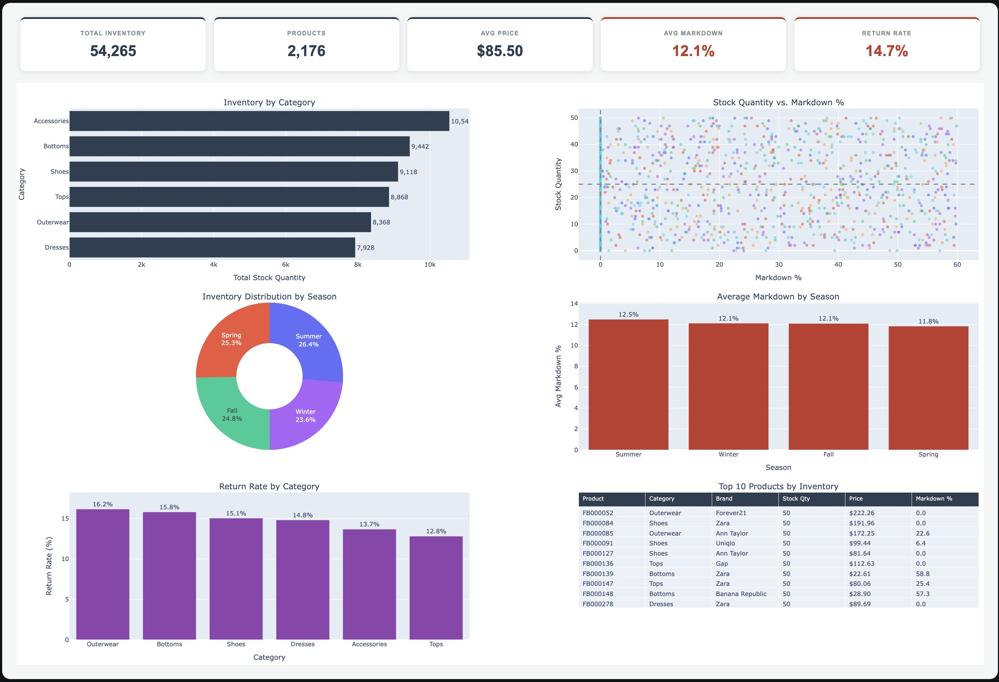

# Assistant Buyer Dashboard

A decision-support dashboard for an assistant buyer role, built **two ways** from the same flat dataset — once in **Python (pandas + Plotly)**, once in **Excel (formulas + native charts)** — to show the same analysis through two different toolsets.


<!--
  👆 Add your screenshot here:
  1. Open Assistant_Buyer_Dashboard.ipynb, run all cells, and screenshot the combined
     Executive Dashboard card (KPI row + chart grid) near the top of the notebook.
  2. Save it as docs/screenshot-dashboard.png in this repo.
  3. That's it — this line will render it automatically.
-->

## What this project demonstrates

Given a flat retail dataset with **no sales-volume, revenue, or supplier data** — only stock, pricing, markdown, ratings, and returns — this project builds a rule-based, decision-support tool for an assistant buyer, and does it twice: once as a Python analysis notebook, once as a live Excel workbook. Same data, same logic, two different skill sets.

**⚠️ Analytical limitations, upfront:** This dataset does **not** provide actual sales volume, units sold, revenue, supplier data, or lead times — so nothing here performs sales forecasting, demand forecasting, or procurement optimization. This is positioned strictly as **Assistant Buyer / Merchandising Decision Support**: inventory, pricing, markdown, assortment, ratings, and returns only.

---

## Approach 1: Python Notebook (`Assistant_Buyer_Dashboard.ipynb`)

Built with `pandas` for calculations and `Plotly` for charts, runnable in Jupyter or Google Colab.

**Techniques showcased:**
- Data cleaning & tiering — `pandas` quantile-based segmentation (terciles for stock, percentile cutoffs for markdown), explicit handling of missing data (17% of ratings are null and are excluded from rule logic rather than imputed)
- Rule-based recommendation engine — a vectorized `apply()` function flagging each product 🔥 BUY / 👀 MONITOR / 🛑 HOLD from the tiers above
- One unified dashboard card — KPI cards and a 6-chart Plotly subplot grid (bar, scatter, donut, table) rendered together as a single HTML block, mirroring a BI-tool look inside a notebook
- Chart-by-chart narrative — each visualization is revisited standalone afterward with a written, data-driven "what this tells us" read (e.g. correlation coefficients, not just pictures)

**Run it:**
```bash
python3 -m venv venv
source venv/bin/activate
pip install -r requirements.txt
```

Run local:
```bash
source venv/bin/activate
jupyter notebook Assistant_Buyer_Dashboard.ipynb
```

Or
```
Open in Visual Studio Code as notebook, use venv as kernel

and Run or Restart All
```

Or 
open directly in [Google Colab](https://colab.research.google.com/) and upload the notebook + CSV.

---

## Approach 2: Excel Workbook (`Assistant_Buyer_Dashboard.xlsx`)

The same analysis, rebuilt natively in Excel — no Python, no macros, everything formula-driven so it recalculates live if the source data changes.

**Techniques showcased:**
- `SUMIFS` / `AVERAGEIFS` / `COUNTIFS` — pivot-style summary tables (inventory by category, markdown by season, return rate by category) built entirely from formulas rather than static pivot table snapshots
- `PERCENTILE` + nested `IF` / `AND` / `OR` — the same tercile/threshold tiering and BUY/MONITOR/HOLD recommendation logic as the Python version, reimplemented as live worksheet formulas across all 2,176 rows
- `LARGE` + `INDEX` / `MATCH` with a tie-breaker key — a correct Top 10 by Inventory table, handling the fact that 42 products are tied at the dataset's max stock value (a naive lookup would return duplicates)
- Data Validation + dynamic lookup — a category dropdown on the dashboard that updates a live snapshot via `INDEX`/`MATCH`, without any macros or slicers
- Native Excel charts + conditional formatting — bar, scatter, and doughnut charts built from the formula tables, plus color-scale flags on any category/season exceeding the dataset's overall average

**Why formulas instead of native PivotTables/Slicers:** auto-generating true native PivotTables outside of Excel itself is notoriously fragile (frequent "needs repair" prompts). The formula-driven approach above is arguably a stronger analyst-skill showcase — and it's verified to open with zero formula errors.

**Open it:** just open `Assistant_Buyer_Dashboard.xlsx` in Excel (or Google Sheets/LibreOffice Calc) — no setup required. Start on the **Dashboard** tab.

---

## Repo structure

```
assistant-buyer-dashboard/
├── README.md
├── Assistant_Buyer_Dashboard.ipynb      # Python / pandas / Plotly version
├── Assistant_Buyer_Dashboard.xlsx       # Excel formulas / native charts version
├── fashion_boutique_dataset.csv         # source data
└── docs/
    ├── project-spec.md                  # full project specification
    └── screenshot-dashboard.jpg         # notebook dashboard screenshot (add your own)
```

## Buyer recommendation logic (prototype, both versions)

| Flag | Criteria |
|---|---|
| 🔥 **BUY / PRIORITIZE** | Low stock tier **and** Low markdown tier **and** Good rating tier |
| 🛑 **HOLD / REVIEW** | High stock tier **and** High markdown tier **and** (Poor rating **or** returned) |
| 👀 **MONITOR** | Everything else |

> This is an illustrative rule-based prototype for demonstration purposes — not an actual retailer's buying methodology.

## Data source

[Retail Fashion Boutique Data – Sales Analytics 2025](https://www.kaggle.com/datasets/pratyushpuri/retail-fashion-boutique-data-sales-analytics-2025) (Kaggle), 2,176 rows × 14 columns.

## Inspiration

Layout inspired by [Zara Sales Analysis](https://github.com/Mehdi-Benbiba/Zara-Sales-analysis) — this project intentionally tells a different analytical story (inventory/markdown/returns/ratings) since sales-volume data isn't available here.
